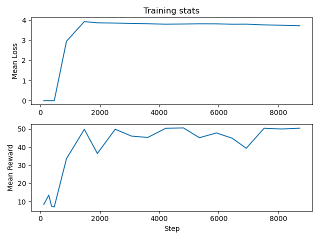
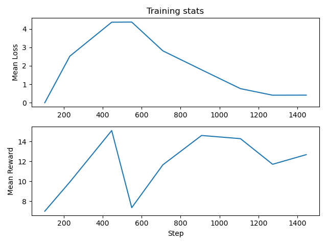

# OmniNav

Rainbow - DQN Algorithm Applications Towards Self-Driving Cars

### Abstract

Decision making for self-driving cars is challenging due to the complex policies that govern such high-dimensional and multi-agent environments. Most methods rely on hard-coded rules assigned by the developers, thus yielding suboptimal agent policies. In this work, we present **OmniNav**, a Deep Reinforcement Learning agent that tackles the difficulty of learning an optimal policy by leveraging the Rainbow - DQN algorithm. Our framework constantly evaluates both a *value* and an *advantage* function using fully-connected networks. It employs NoisyNets to explore the intricate patterns of any environment without the need of a $\epsilon$ - greedy algorithm. We evaluate OmniNav on the [highway-v0](https://github.com/Farama-Foundation/HighwayEnv) environment to observe a $xx$ average agent return value with a response time of $yy$ seconds on a NVIDIA GTX 1660 Ti GPU.

### References

When using any of this project's source code, please cite:
```bibtex
@misc{karatzas2023omninav,
      title={OmniNav: Rainbow - DQN Algorithm Applications Towards Self-Driving Cars},
      author={Andreas Karatzas},
      year={2023},
      publisher = {GitHub},
      journal = {GitHub repository},
      howpublished = {\url{https://github.com/AndreasKaratzas/omninav}},
}
```

### Installation

```bash
conda env create --file environment.yml
conda activate omninav
```

If you either added or removed packages, then you can save a checkpoint of the `conda` environment by:
```bash
conda env export --no-builds > environment.yml
```

### Usage

To train the agent with the MLP policy, use:
```bash
python train.py --device 'cuda:0' --mem-capacity 50000 --batch-size 64 --target-sync 500 --learning-starts 500 --num-of-steps-to-checkpoint-model 1000 --num-of-steps-to-checkpoint-memory 2000 --episodes 200 --gamma 0.9 --alpha 0.4 --beta 0.6 --prior-eps 1e-6 --v-min -10.0 --v-max 100.0 --n-atoms 51 --n-step 3 --verbosity 10 --learning-rate 5e-4 --info --use-deterministic-algorithms --clip-grad-norm 40.0 --top-k 10 --num-hiddens 256 --wandb --tensorboard --name "Rainbow" --store "options" --verbose --seed 33
```

To train the agent with the CNN policy, use:
```bash
python train.py --device 'cuda:0' --mem-capacity 100000 --batch-size 128 --target-sync 1000 --learning-starts 2000 --num-of-steps-to-checkpoint-model 1000 --num-of-steps-to-checkpoint-memory 2000 --episodes 500 --gamma 0.99 --alpha 0.4 --beta 0.6 --prior-eps 1e-6 --v-min -10.0 --v-max 100.0 --n-atoms 51 --n-step 3 --verbosity 10 --learning-rate 25e-4 --info --use-deterministic-algorithms --clip-grad-norm 40.0 --top-k 10 --num-hiddens 512 --wandb --tensorboard --name "Rainbow" --store "options" --verbose --seed 33 --en-cnn
```

To test the agent, use:
```bash
python test.py --device 'cuda:0' --episodes 5 --verbosity 1 --info --use-deterministic-algorithms --name "Rainbow" --sync "data/2023-AA-BBTCC-DD-EE" --verbose --seed 33 [--en-cnn]
```

### Results

To monitor with TensorBoard, use:

```bash
tensorboard --logdir=./data/datetime/ --host localhost --port 8888
```

The agent with the MLP policy achieves:



The agent with the CNN policy achieves:

